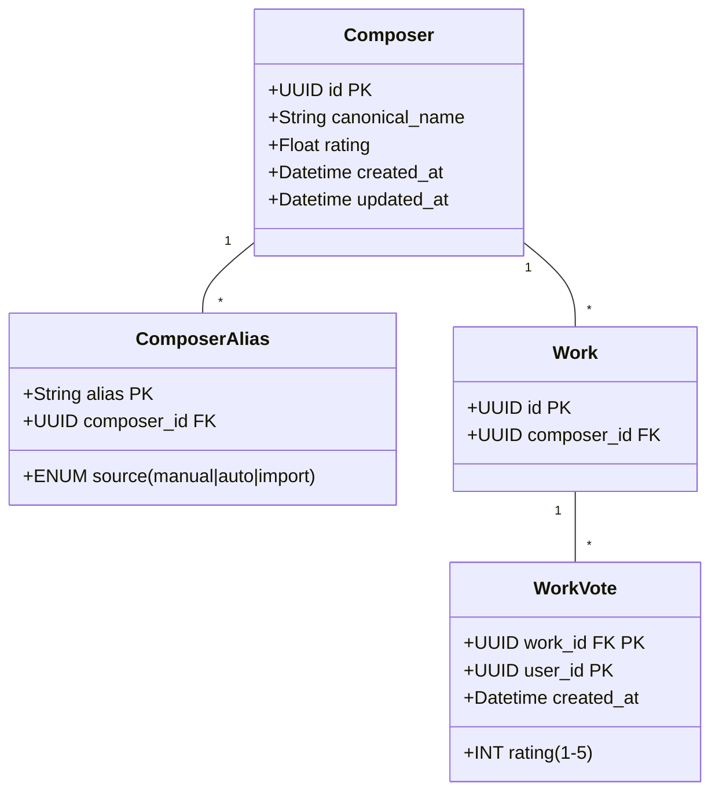

# Sistema de Gestión de Compositores y Valoraciones (v3)

## Modelo de Datos


## Endpoints API
### Compositores
```http
# Búsqueda con alias
GET /api/v3/composers?query=Bach

# Fusionar compositores
POST /api/v3/composers/merge
{
  "primary_id": "uuid_destino",
  "merge_ids": ["uuid_a_fusionar"]
}
```

### Votaciones
```http
# Registrar voto
POST /api/v3/works/{{work_id}}/vote
{ "rating": 4 }
```

## Proceso Nocturno
```python src/osap/cron/daily_ratings.py
from sqlalchemy import func
from models import Composer, Work, WorkVote, session

def calculate_composer_ratings():
    """
    Calcula valoración media por compositor
    """
    # Paso 1: Obtener valoración media por obra
    works_avg = (
        session.query(
            Work.composer_id,
            func.avg(WorkVote.rating).label('avg_rating')
        )
        .join(WorkVote, Work.id == WorkVote.work_id)
        .group_by(Work.id)
        .subquery()
    )
    
    # Paso 2: Calcular media por compositor
    composer_ratings = (
        session.query(
            works_avg.c.composer_id,
            func.avg(works_avg.c.avg_rating).label('composer_rating')
        )
        .group_by(works_avg.c.composer_id)
    ).all()
    
    # Paso 3: Actualizar registros
    for composer_id, rating in composer_ratings:
        session.query(Composer)
            .filter(Composer.id == composer_id)
            .update({Composer.rating: rating})
    
    session.commit()
```

## Vista de Administración
```tsx web/src/admin/ComposerAdminPanel.tsx
export default function ComposerAdminPanel() {
  const [composers, setComposers] = useState<ComposerWithAliases[]>([]);

  // Carga compositores con alias ambiguos
  useEffect(() => {
    api.get('/composers?filter=requires_review')
      .then(data => setComposers(data));
  }, []);

  // Maneja fusión
  const handleMerge = (primaryId: string, mergeIds: string[]) => {
    api.post('/composers/merge', { primaryId, mergeIds });
  };

  return (
    <div className="composer-admin">
      <AliasManagement 
        composers={composers} 
        onAliasSubmit={/*...*/} 
      />
      <MergeTool 
        composers={composers}
        onMerge={handleMerge}
      />
    </div>
  );
}
```

### Componente MergeTool
```tsx web/src/admin/components/MergeTool.tsx
interface MergeToolProps {
  composers: ComposerWithAliases[];
  onMerge: (primaryId: string, mergeIds: string[]) => void;
}

export function MergeTool({ composers, onMerge }: MergeToolProps) {
  // Estado para selección
  const [primary, setPrimary] = useState<Composer>();
  const [toMerge, setToMerge] = useState<Composer[]>([]);

  return (
    <div>
      <h3>Fusionar Compositores</h3>
      <ComposerSelector 
        composers={composers}
        onSelectPrimary={setPrimary}
      />
      <ComposerSelector 
        composers={composers.filter(c => c.id !== primary?.id)}
        onSelectMultiple={setToMerge}
        multiple
      />
      <button 
        onClick={() => primary && onMerge(primary.id, toMerge.map(c => c.id))}
        disabled={!primary || toMerge.length === 0}
      >
        Fusionar Compositores
      </button>
    </div>
  );
}
```

## Migración
```sql migrations/v3_create_composers.sql
-- Tabla de compositores
CREATE TABLE composers (
    id UUID PRIMARY KEY DEFAULT gen_random_uuid(),
    canonical_name TEXT NOT NULL,
    rating FLOAT DEFAULT 0.0,
    created_at TIMESTAMPTZ DEFAULT NOW(),
    updated_at TIMESTAMPTZ DEFAULT NOW()
);

-- Alias de compositores
CREATE TABLE composer_aliases (
    alias TEXT NOT NULL,
    composer_id UUID REFERENCES composers(id) ON DELETE CASCADE,
    source composer_alias_source NOT NULL,
    PRIMARY KEY (alias, composer_id)
);

-- Tabla de votos
CREATE TABLE work_votes (
    work_id UUID NOT NULL REFERENCES works(id) ON DELETE CASCADE,
    user_id UUID NOT NULL REFERENCES users(id) ON DELETE CASCADE,
    rating SMALLINT CHECK (rating BETWEEN 1 AND 5),
    created_at TIMESTAMPTZ DEFAULT NOW(),
    PRIMARY KEY (work_id, user_id)
);
```